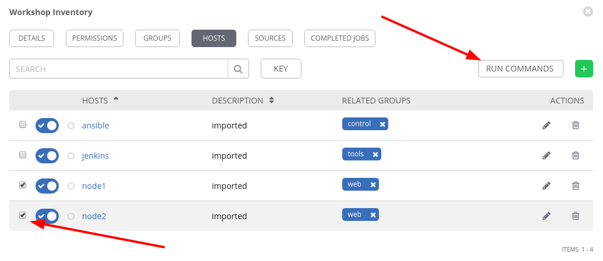
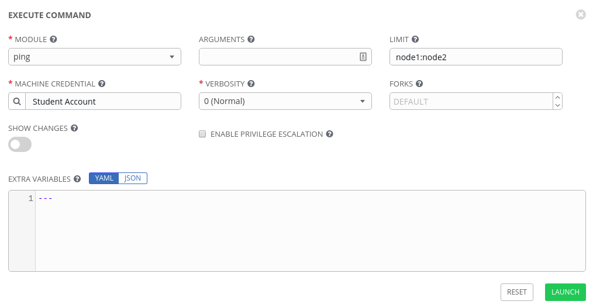
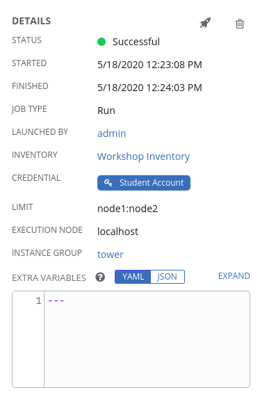
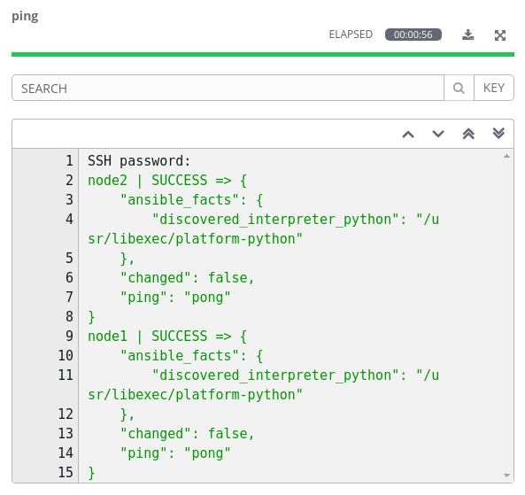
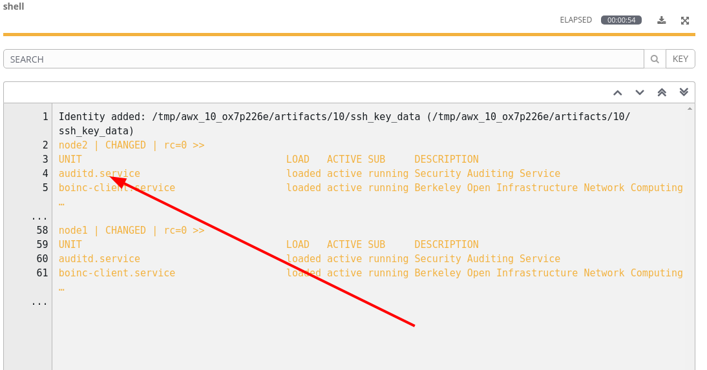
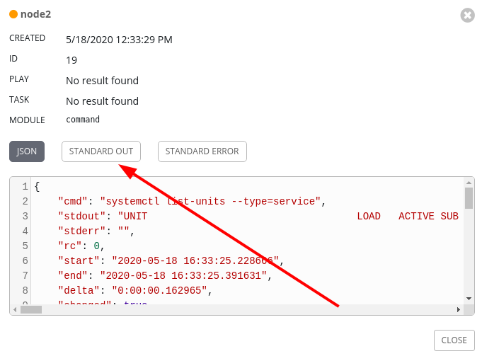
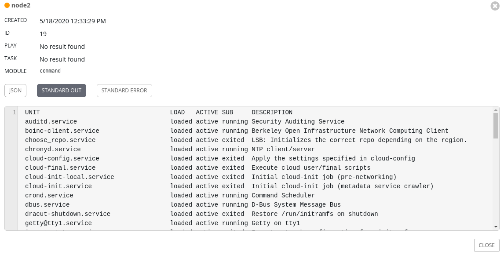
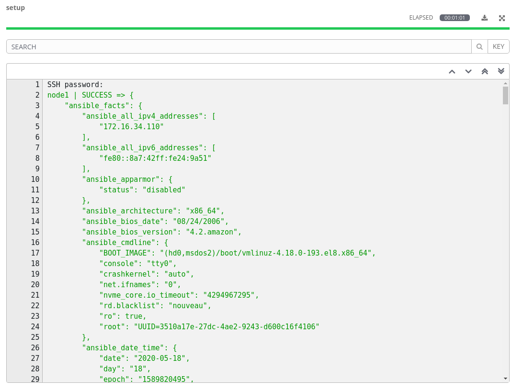

Section 1: Ad-hoc commands
==========================

For our first exercise, we are going to run some ad-hoc commands to help
you get a feel for how Ansible works. Ansible Ad-Hoc commands enable you
to perform tasks on remote nodes without having to write a playbook.
They are very useful when you simply need to do one or two things
quickly, to many remote nodes.

Step 1:
-------

To start, we will need to go to our Inventory. So click **Inventories**
on the left panel, and then click the name of our Inventory **Workshop Inventory**. Now that you are on the Inventory Details page, we
will need to go select our Host. So click **HOSTS**.

Next to each host is a checkbox. Check the box next to both of the nodes ( node1 and node2). You will then see the **RUN COMMANDS**
button become enabled. Click it now.

This will pop up the **Execute Command** window. From here is where we
can run a single task against our hosts.

Let’s start with something really basic - pinging a host. The `ping`
module makes sure our hosts are responsive. This is not a
traditional *ping*, but actually verifying both connectivity and
authentication to the host.

Fill out this form as follows

| Key                | Value           | Note                                                            |
|--------------------|-----------------|-----------------------------------------------------------------|
| Module             | `ping`      |                                                                 |
| Arguments          |                 | Intentionally blank                                             |
| Limit              |                 | This will be pre-filled out for you with the hosts you selected |
| MACHINE CREDENTIAL | Student Account |                                                                 |

Once you click **LAUNCH** you will be redirected to the Job log. Every
job and action in Ansible Tower is recorded and stored. These logs can
be auto-rotated and can also be exported automatically to another
logging system such as Splunk or ELK.

The first part of the log shows you the details of the job. This
includes information such as who launched the job, against what hosts,
and when.

The second part of the job log shows you the actual output from the
command. If your connection was successful, you should see a result such
as this.

The results returned will be different depending on which module is
used, as they all handle and deal with different data sets depending on
the task. No matter which module is used, you will always see a color
coded STATUS of either SUCCESS, FAILURE, CHANGED, or SKIPPING.

Step 2:
-------

Now let’s see how we can run a shell command and view the output
using the `shell` module.

Let’s fill out the form again, but this time use the `shell` module
to list all services on the nodes execute the `systemctl list-units --type=service
` shell command.

| Key                | Value           | Note |
|--------------------|-----------------|------|
| Module             | `shell`     |      |
| Arguments          | `systemctl list-units --type=service`   |      |
| MACHINE CREDENTIAL | Student Account |      |

There is a lot of ouput from the list of services but we can read it easier on tower but clicking on the output 

This gives us the output for the run on the node we can also change this from the json output to the standard output, to make it even easier to read expand the output window.

Launch the job and view the results. You will see that it returns a
direct output of what the shell command returned. This data can be
stored to a variable and directly parsed inside your Ansible playbook
later on.

And run it one more time with the `cat /etc/redhat-relase` shell command.

| Key                | Value           | Note |
|--------------------|-----------------|------|
| Module             | `shell`     |      |
| Arguments          | `cat /etc/redhat-release`   |      |
| MACHINE CREDENTIAL | Student Account |      |

Step 3:
-------
We will now take a look at your nodes configuration. The `setup`
module queries the remote host for various data and returns that data as
Ansible facts. This data is useful to determine things such as OS
Versions, Hardware Configuration, and other data points. This
can then be used in your playbook for all sorts of reasons such as
determining whether a task should even run, or determining what the name
of a package should be based upon the OS Version.

The `setup` module will run automatically at the beginning of every
playbook, unless configured not to, so that this data is always available to
your playbook.

Lets go ahead and run the `setup` module to look at the output. Fill out
the **EXECUTE COMMAND** form again with this info.

| Key                | Value           | Note                |
|--------------------|-----------------|---------------------|
| Module             | `setup`         |                     |
| Arguments          |                 | Intentionally blank |
| MACHINE CREDENTIAL | Student Account |                     |

You will then see results like this

(**Note:** If you click the three dots shown on line 23 in the above output, you will see all the facts returned by the `setup` module.)

End Result
----------

Ad-hoc commands may be useful to run once in a while to perform checks. However, as automation continues to grow within an environment, they are used less and less often. This interaction with ad-hoc commands seems to mimic running individual commands from a CLI.
