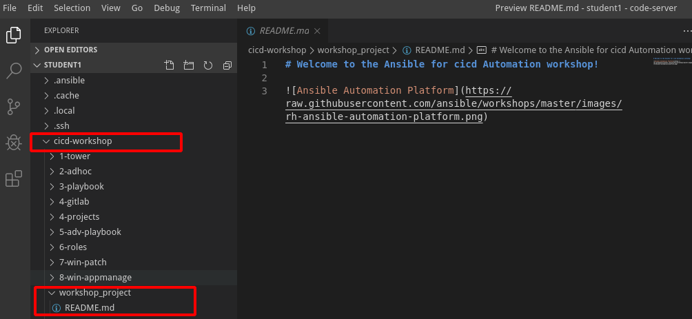
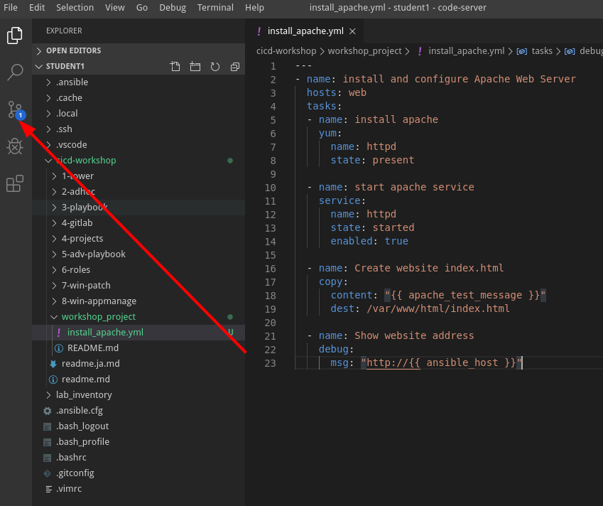
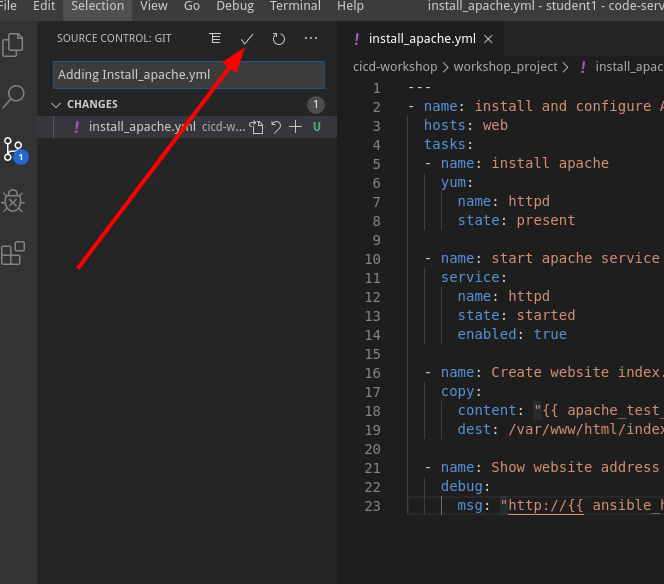
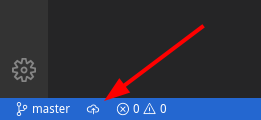
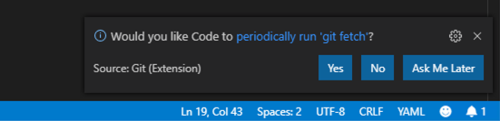
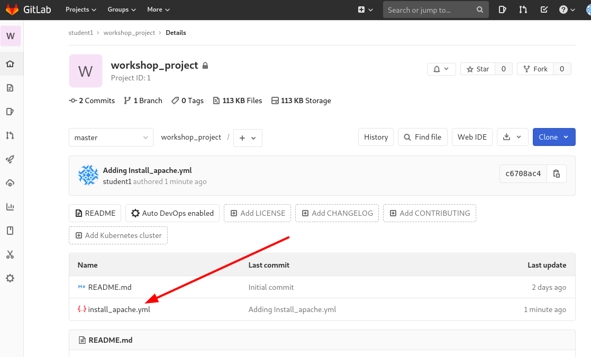

A playbook is where you list the steps you would like to automate into a repeatable set of **plays** and **tasks**. Our playbooks will be stored in our **source control management** (SCM) system to version our
playbooks.

A playbook can have multiple plays and a play can have one or multiple
tasks. The goal of a **play** is to map a group of hosts. The goal of a
**task** is to implement modules against those hosts.


Overview
========

Starting at this task we are going to use Visual Studio Code as our
editor. In addition, we will use GitLab for source code control. This
will allow us to minimize development work on the linux command line.
Other editors or source code solutions can be used, but this will show
the general workflow.

Section 1: Creating a Directory Structure and Files for your Playbook
=====================================================================

There is a [best
practice](http://docs.ansible.com/ansible/playbooks_best_practices.html)
on the preferred directory structures for playbooks. We strongly
encourage you to read and understand these practices as you develop your
Ansible skills.

**Step 1:**

Open Visual Studio Code

For this lab, we have already created a clone of your Git repository for
you.

To access it, click the link for VS Code Access from the workshop page.

At this point in the Explorer sidebar you should have a *CICD-WORKSHOP* folder with a subfolder *WORKSHOP_PROJECT*
section with only a README file in it.



**Step 2:** Right click on the workshop_project folder and select new file and call the file install_apache.yml

Section 2: Defining Your Play
=============================

Now that you are editing `install_apache.yml`, let’s begin by defining our play.

```yaml
    ---
    - name: install and configure Apache Web Server
      hosts: web
```

- `---` Defines the beginning of YAML

- `name: install the Apache Web Service` This describes our play

- `hosts: web` Defines the host group in your inventory on which this
  play will run against

Section 3: Adding Tasks to Your Play
====================================

Now that we’ve defined the play, We need to add some tasks to get some
things done.
Yes, it does actually matter. In fact, you should make sure all of your
playbook statements are aligned in the way shown here. You also must use
spaces for indentation. Tabs are not valid YAML syntax.
If you want to see the entire playbook for reference, skip to the bottom
of this exercise.

<!--  -->
```yaml
      tasks:
       - name: install apache
         yum:
           name: httpd
           state: present

       - name: start apache service
         service:
           name: httpd
           state: started
           enabled: true

       - name: Create website index.html
         copy:
           content: "{{ apache_test_message }}"
           dest: /var/www/html/index.html

       - name: Show website address
         debug:
           msg: "http://{{ ansible_host }}"
```
<!--  -->

- `tasks:` This denotes that one or more tasks are about to be defined

- `- name:` Each task requires a name which will print to standard
  output when you run your playbook. Therefore, give your tasks a name
  that is short, sweet, and to the point

<!-- -->

```yaml
    yum:
      name: httpd
      state: present
```

- These three lines are calling the Ansible module **`yum`** to
  install the Apache Web Server package. [Click
  here](http://docs.ansible.com/ansible/latest/yum_module.html)
  to see all options for the `yum` module.

<!-- -->
```yaml
    service:
      name: httpd
      state: started
      enabled: true
```

- The next few lines are using the ansible module **service** to
  start and ensure it starts on a reboot of the httpd service. The `service` module is the preferred way
  of controlling services on remote hosts. [Click
  here](http://docs.ansible.com/ansible/latest/service_module.html)
  to learn more about the **`service`** module.

<!--  -->
```yaml
    copy:
      content: "{{ apache_test_message }}"
      dest: /var/www/html/index.html
```
<!--  -->

- In this task, we use the copy module to create a file with
  specific contents in it. We are getting a little more complex here
  as we are using a variable to source the contents. We won’t go into
  the variables just yet, since they will be showcased in a later
  lesson.

<!--  -->
```yaml
    debug:
      msg: http://{{ ansible_host }}
```
<!--  -->

- This task uses the `debug` module to post a message at the end of playbook execution. This particular message prints out `http://` + the variable name that contains the IP address of the host we're running the playbook on (our apache web server)

Section 4: Saving your Playbook
===============================

Now that you’ve completed writing your playbook, it would be a shame not
to keep it. Click `File > Save` from the menu.

And that should do it. You should now have a fully written playbook
called `install_apache.yml`.

But wait!!! We haven’t committed our changes from our **local** copy to
**git**. Click the Source Code icon as shown below (It is the middle on
the far left of the page that has the blue circle with \# 1 in it)



Type in a commit message such as *Adding install\_apache.yml* in the text
box at the top of the sidebar. Click the check box above to commit. This
message is intended to describe the changes you made so that others
(including yourself) better understand what is changing when comparing
versions.



Now you need to push the committed changes to your repository.

On the bottom left blue bar, click the section that contains the
circular arrows to push the changes.



This may take as long as 30 seconds to push. After your first push, you
may get a pop-up message asking if you would like to periodically run
git fetch. Because you’re the only one working on the git repo, you can
click **Yes** or **No**.



If you’re interested in validating the code is in git, you can connect
to GitLab to verify. Go back to the workshop page, and click the link under **GitLab Access** taking note of your username and password.



You are ready to automate!

> **Note**
>
> Ansible (well, YAML really) can be a bit particular about formatting
> especially around indentation/spacing. When you get back to the
> office, read up on this [YAML
> Syntax](http://docs.ansible.com/ansible/YAMLSyntax.html) a bit more
> and it will save you some headaches later. In the meantime, your
> completed playbook should look like this. Take note of the spacing and
> alignment.

<!--  -->
```yaml
    ---
    - name: install and configure Apache Web Server
      hosts: web

      tasks:
      - name: install apache
        yum:
          name: httpd
          state: present

      - name: start apache service
        service:
          name: httpd
          state: started
          enabled: true

      - name: Create website index.html
        copy:
          content: "{{ apache_test_message }}"
          dest: /var/www/html/index.html

      - name: Show website address
        debug:
          msg: "http://{{ ansible_host }}"
```
<!--  -->
