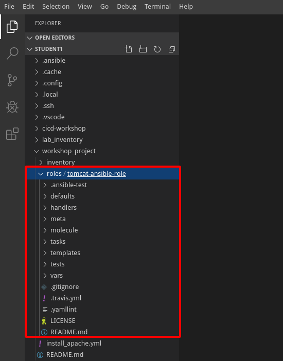
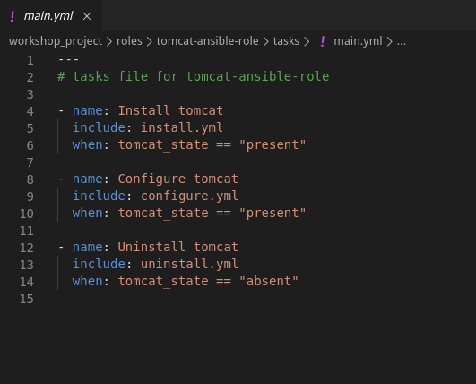
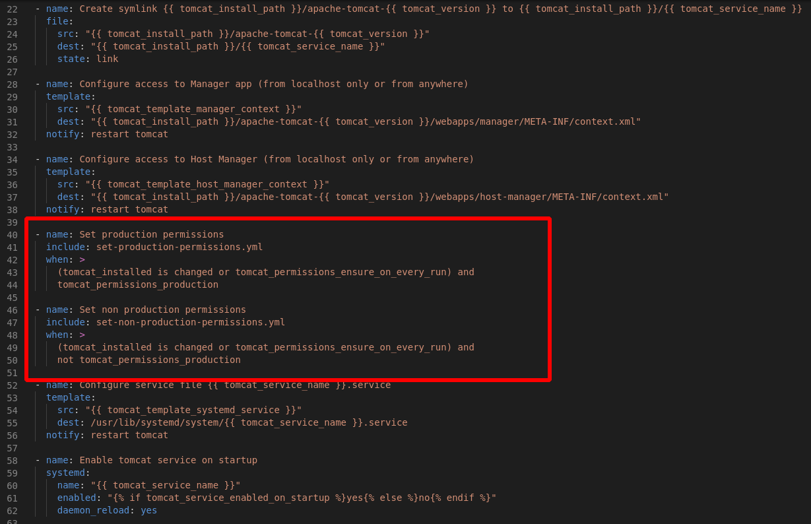
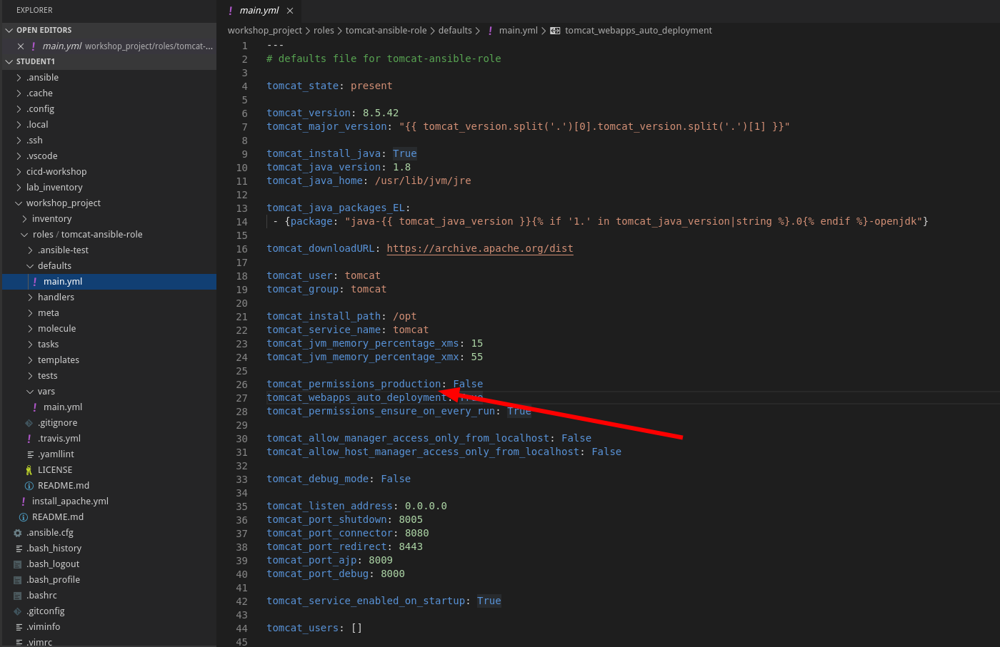
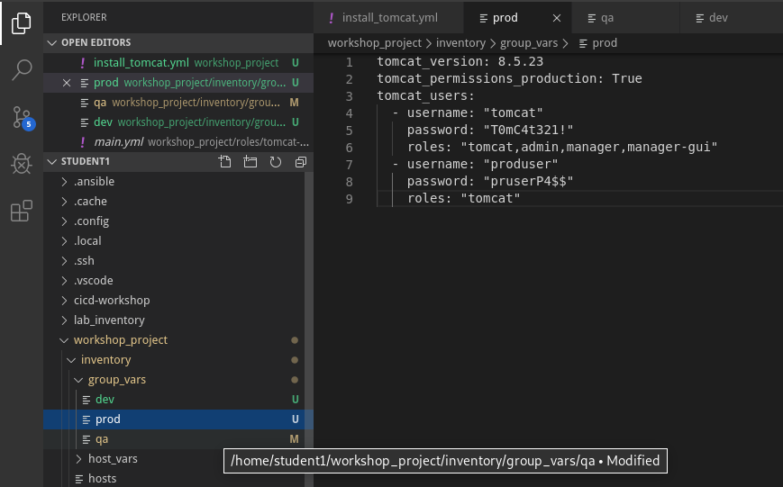

Although it is possible to write a playbook in one file as we’ve done
throughout this workshop. As we get progress we will start to see we may
need many tasks to complete and this will become difficult to manage in 1
playbook.

Ansible Roles allow you split this up into many files to make it easier to
create and debug but also easier for others to reuse your work. 

We are not going to write out a role but instead use a role and modify it where
needed to understand the usage of roles.

Section 1: Review the role directory structure
=======================================================

Step 1:
-------

In Visual Studio Code, navigate to explorer and your **workshop_project** folder there is a sub directory called **roles** and you will see a role directory called **tomcat-ansible-role**



Step 2:
-------

We can see how a role has structure associated with it and is self contained.

default -> Default variables
handlers: -> the handle tasks we notify
meta -> information about the role used by Galaxy and Molecule
molecule -> Testing Framework
tasks -> The tasks associalted
templates -> Jinja2 Template files 
tests -> testing spec files for the role
vars -> Variables for the role

Step 3:
---

Ansible will read a default main.yml for the tasks and handlers, if we go into the tasks/main.yml file we can see we can split this up even more to make it more managable.



By using the Ansible when conditions we can state when you include the other playbooks.

If we state tomcat should be present then the install and configure playbooks will run, but if its set as absent then only the uninstall playbook will run.

Step 4:
---
Looking at the cofigure.yml file we can see that a condition is set based on if the desired state is for production or not and that we have actually installed.



How else could we make a decision where we would need to set a variable flag?

Step 5:
---
The defaults/main.yml file will show all the variables we can use with the role and the default answer if we dont specify it else where.



We have various options here like the version of Java to install and the ability to not install java if using another role for this, the tomcat default user and group.

The production permissions is set to false by default but we can use this in our group vars to ensure our production boxes would get that.

Step 6:
---

We need to create a playbook to be able to use this role, there is a README.md file in the root of the role that gives us much more information on the role variables but also shows us an example playbook.

Example Playbook
----------------
```yaml
- hosts: servers
  become: true
  vars:
    tomcat_version: 8.5.23
    
    tomcat_permissions_production: True
    
    tomcat_users:
      - username: "tomcat"
        password: "t3mpp@ssw0rd"
        roles: "tomcat,admin,manager,manager-gui"
      - username: "exampleuser"
        password: "us3rp@ssw0rd"
        roles: "tomcat"        
  roles:
    - role: tomcat-ansible-role
```
All of these variables would be lifecycle controlled. 

*tomcat_version* this would be controlled as we test and promote.

*tomcat_permissions_production* this would is set to false by default but we would want this to be true for production boxes.

*tomcat_users* this is going to be different per lifecycle

Lets create a playbook by right clicking on the **workshop_project** directory and select new file, and call it install_tomcat.yml

Lets populate it with the following

```yaml
---
- name: Install Apache Tomcat
  hosts: dev,qa,prod
  
  roles:
    - role: tomcat-ansible-role
```
Lets also create the uninstall playbook at the same time right click and add a new file called uninstall_tomcat.yml and add in the following

```yaml
---
- name: Uninstall Apache Tomcat
  hosts: dev,qa,prod
  vars:
    tomcat_state: absent

  roles:
    - role: tomcat-ansible-role
```


Step 7:
---

Navigate back to our **inventory/group_vars** and create a file called prod and add the following lines

```yaml
tomcat_version: 8.5.23
tomcat_permissions_production: True
tomcat_users:
  - username: "tomcat"
    password: "T0mC4t321!"
    roles: "tomcat,admin,manager,manager-gui"
  - username: "produser"
    password: "PRuserP4$$"
    roles: "tomcat"     
```
Edit the qa group_vars file and add in the following
```yaml
tomcat_version: 8.5.23
tomcat_users:
  - username: "tomcat"
    password: "TCP@$$w0rd"
    roles: "tomcat,admin,manager,manager-gui"
  - username: "qauser"
    password: "QAuserP4$$"
    roles: "tomcat"
```
finally create a dev file and add the following
```yaml
tomcat_version: 8.5.23
tomcat_users:
  - username: "tomcat"
    password: "TCP@$$w0rd"
    roles: "tomcat,admin,manager,manager-gui"
  - username: "devuser"
    password: "DEVuserP4$$"
    roles: "tomcat"
```



Step 8:
===
commit the files and push to git.