An Inventory is where you list hosts to which we would connect to along with the group or individual host variables assisngned. Our Inventory will be stored in our **source control management** (SCM) system so we can dynamically update as needed.

Overview
========

At the end of this section we should have an understanding on how we can create an inventory and populate it with information to be used during a playbook run.

Section 1: Creating a Directory Structure and Files for your Inventory
=====================================================================

There is a [best
practice](https://docs.ansible.com/ansible/latest/network/getting_started/first_inventory.html)
on setting up inventories. We strongly
encourage you to read and understand these practices as you develop your
Ansible skills.

Step 1:
---
We are going to place this in the same *CICD-WORKSHOP* that we used for our apache playbook earlier. This is not a hard requirement as the inventory could reside in a seperate Project if needed.

Step 2:
---
Right click on the workshop_project folder and select new folder and call inventory then right click on inventory and create a new file and call the file hosts
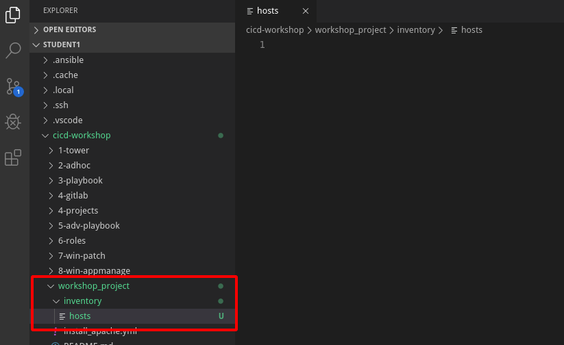

Step 3:
---

You will see there is a folder in your main directory called  lab_inventory folder with a hosts file inside of it you will copy the contents of that hosts file to your new hosts file
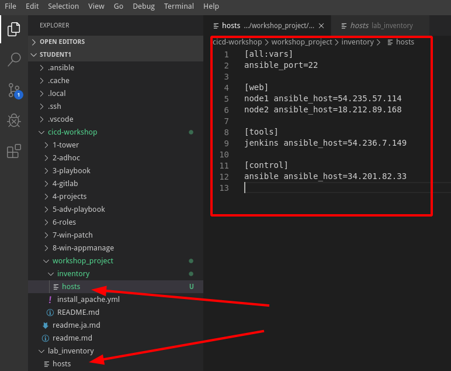

Step 4:
---
Next we want to be able to define variables for the groups and hosts, 

Create 2 folders under inventory called

**group_vars**
**host_vars**

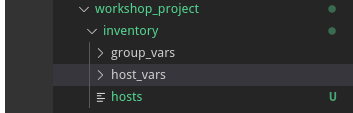

Step 5:
---
We will simply create a file in each directory to reference a hostname of a group name

under host_vars create a file called node1

and add in the following key value pair

`apache_test_message: Hello World Welcome to Node1`

under group_vars create a files called web

and add in the following key value pair

`apache_test_message: Hello World Welcome to the Web Group`

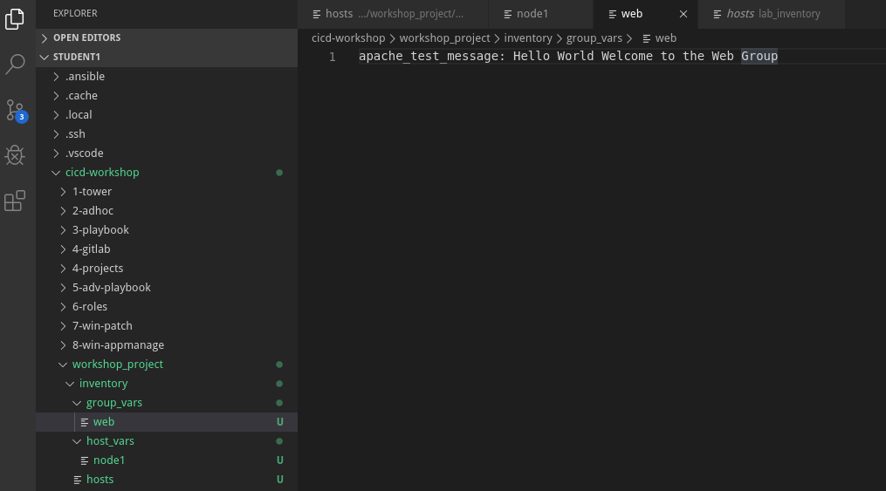

Step 6:
---
Make sure all files are saved and commit them to git

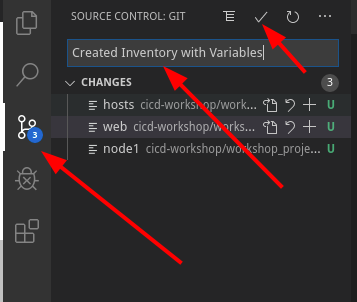

Then resync to push it to GitLab

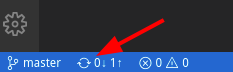

Section 2: Create a dynamic inventory in Tower
=============================

Syncing your Project
====================

Before you can create the inventory we need to refresh out project so that Tower knows about it. To do this, click
**Projects** and then click the sync icon next to your project. Once
this is complete, you can create the inventory.

Step 1:
---
go to Inventories and Click the  icon and add inventory

Fill out the details as such

| Key          | Value           
|--------------|-----------------|------------------------------------------|
| Name         | Student Inventory |                                          |
| Organization | Default         |                                          |

Select SAVE  

Step 2:
---
Select Sources 
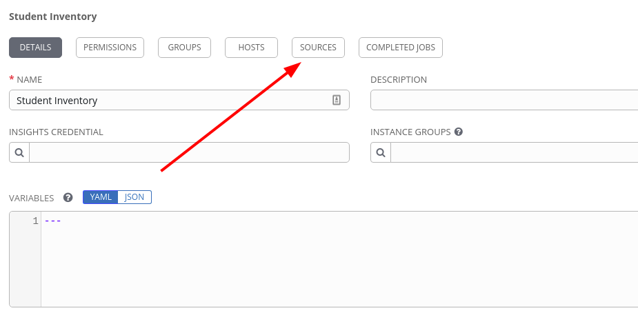

Click the  icon and add inventory source

| Key          | Value           
|--------------|-----------------|------------------------------------------|
| NAME         | GitLab Inventory |                                          |
| SOURCE | Sourced from a Project         |                                          |
|  CREDENTIAL |  |
| PROJECT | Ansible Workshop Project |
| INVENTORY FILE | inventory/hosts |
UPDATE OPTIONS 
- [x] OVERWRITE
- [x] OVERWRITE VARIABLES
- [ ] UPDATE ON LAUNCH 
- [x] UPDATE ON PROJECT UPDATE

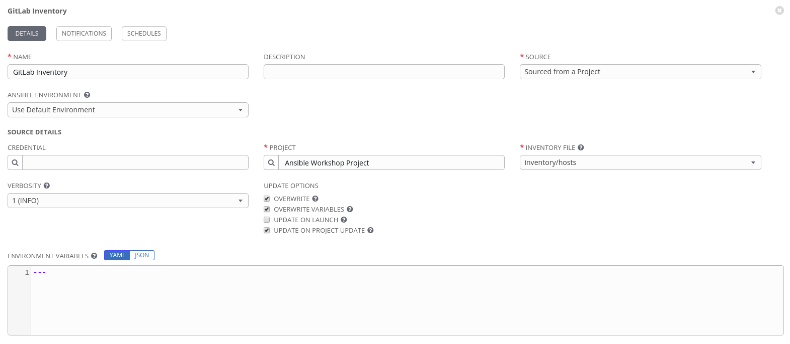 

Select SAVE  

The Inventory will auto update 

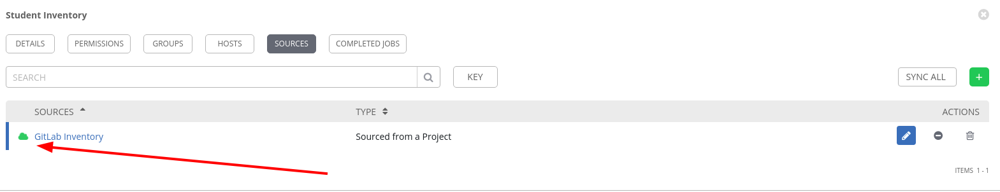 

Section 3: Inventory Review
====================================

Now that we’ve created an inventory source and made it sync we can review its come over as expected

Step 1:
-------

Click **Inventories** from the left hand panel. Click the Inventorie' name **Student 
Inventory** or the Edit button. 

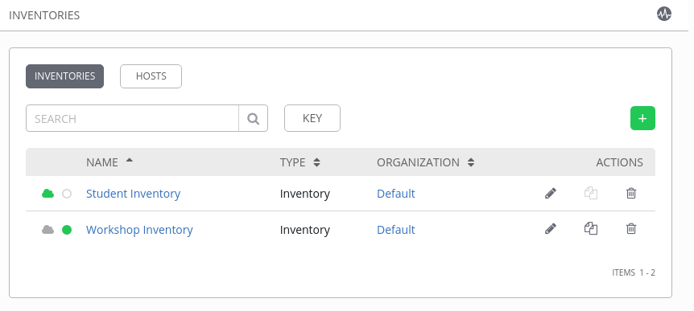

Step 2:
-------

You will now be viewing the Inventory. From here you can view Hosts
Groups

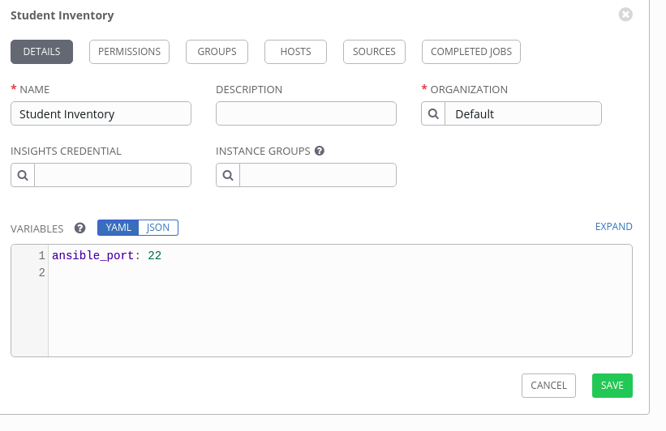

We will be viewing the hosts, so click the **HOSTS** button.

Step 3:
-------

In the Hosts view, we can see every host associated with this
inventory. You will also see which groups a host is associated with.
Hosts can be associated with multiple groups. 
Click on node1 and look at the details we can see this came over from the node1 host vars we created.

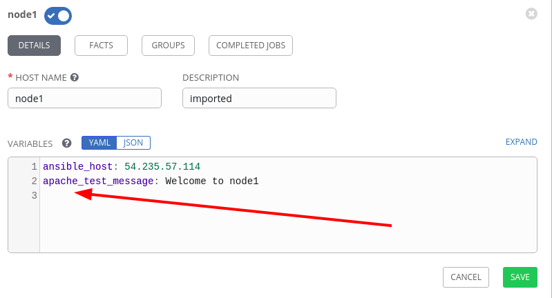

Step 4:
-------

If you click the **GROUPS** button and then select the **web** group, you can See that the variable we assigned to web has also come down as expected.

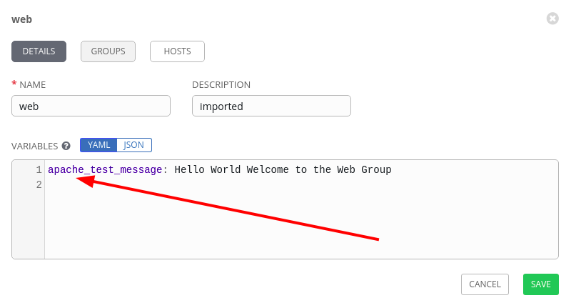

We can use this going forward to specify individual host or group variables to answer our playbooks. We will see how this will perform in the next exercise.