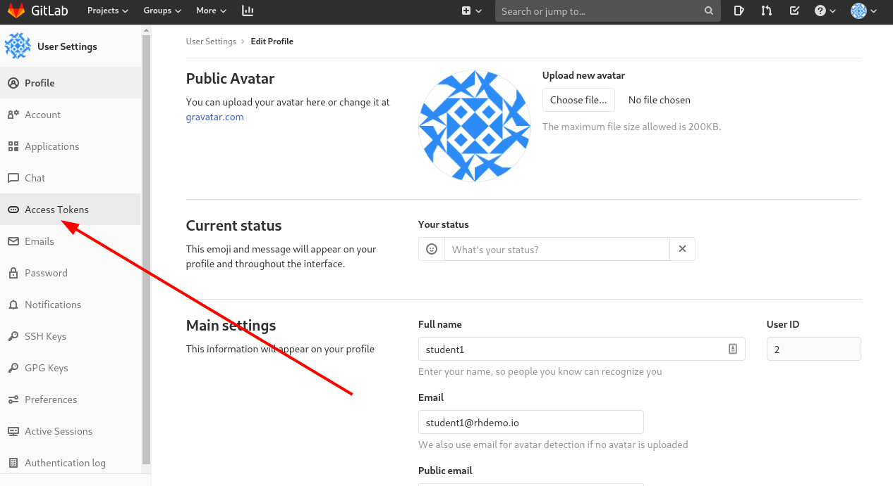
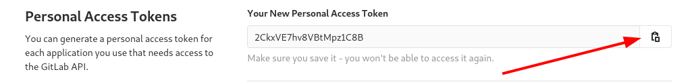
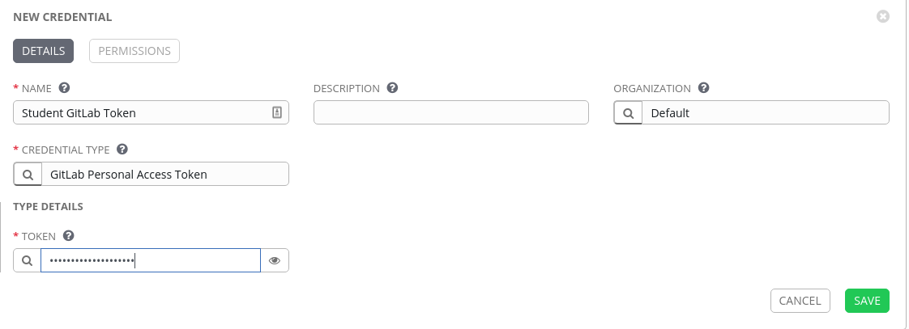
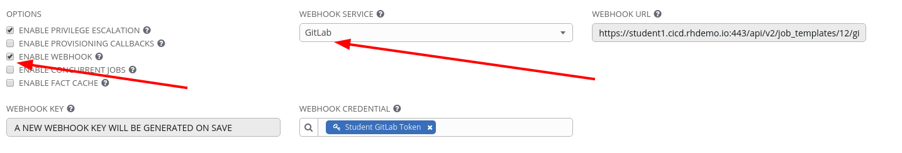
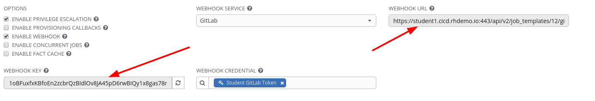
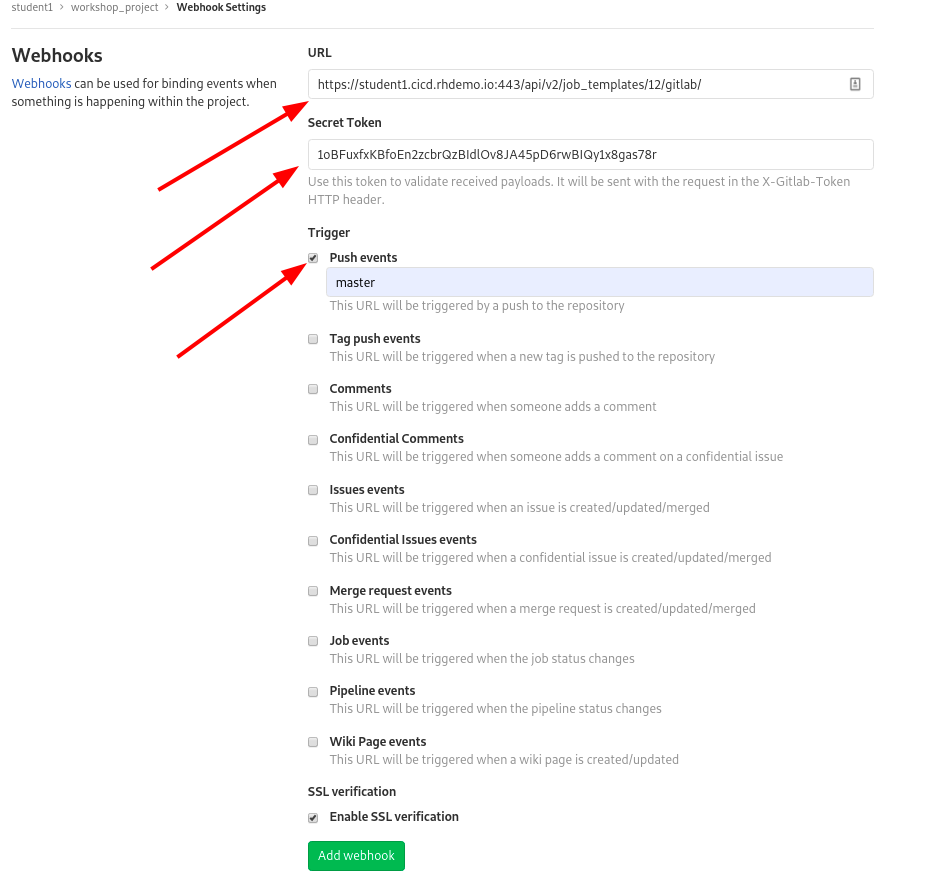

Configuring GitLab
=========================

Now that we have Ansible Tower configured to pull down our initial repository from Gitlab, we want to configure Gitlab and Tower so that the communication is bi-directional, thus at the end of this section we should be able to perform a git commit and see it automaticatlly tell Tower to kick off a job template it is referenced from.

Logging into Gitlab
==================

Your GitLab url and credentials were supplied to you on the page created for this workshop.

Creating a Personal Access Token
=============================
Step 1:
-------
In GitLab click on your user icon and select settings

Step 2:
-------
Now Select the Access Tokens menu

Step 3:
-------
Fill out the form

| Key          | Value           |
|--------------|-----------------|------------------------------------------|
| Name         | Student Tower Token|                                          
| Expires at | Leave Blank                 |
| Scope         | API

Step 4:
-------
Click on Create personal access token.

Step 5:
-------
Once created make sure to copy the token as it will become a hidden secret afterwards.

Create Gitlab Token Credential in Tower
========================

Go to Credentials in Tower and create a new credential

Step 6:
-------

Select CREDENTIALS from the left hand panel under resources

Step 7:
-------

Click the  icon and add new credential

Step 8:
-------

Complete the form using the following entries:

| Key          | Value           
|--------------|-----------------|------------------------------------------|
| Name         | Studen GitLab Token |                                          |
| Organization | Default         |                                          |
| Type         | GitLab Personal Access Token         |                                          |
| TOKEN     | **Replace # with your student number**   |        | 

Step 9:
-------

Select SAVE   

Enable Webhook to our Install Apache Job Template
========================

Lets go back to our Apache Basic Job Template and reconfigure it for bi-directional communication to GitLab.

Under Options we want to select **ENABLE WEBHOOK**

Select SAVE   

After saving we can have the **WEBHOOK** URL and **WEBHOOk KEY**

We need to copy these and add them to GitLab

Enable Webhook to our GitLab Project
==================

Navigate in GitLab to our Project and select on the left hand verticle Settings and then Webhooks

Copy the URL from tower to **URL** and the WEBHOOK KEY to **Secret Token**
Set the trigger to be on **Push events** and lock it to the **master** branch

Select Add webhook 

