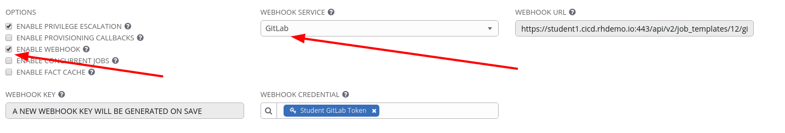
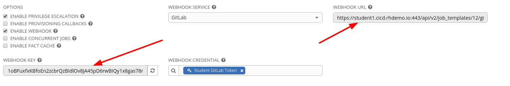
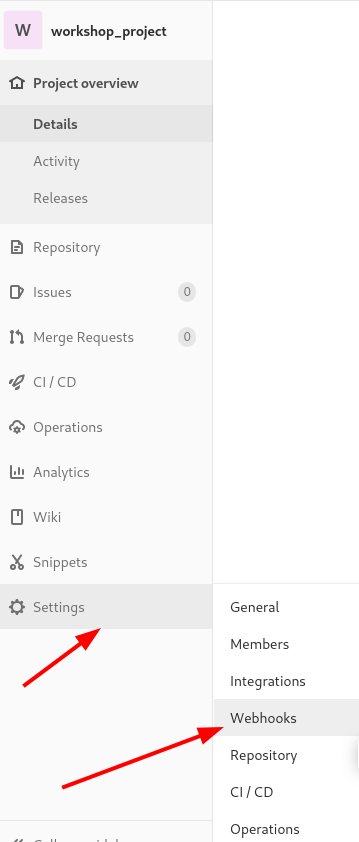

Enable Webhook to our Install Apache Job Template
========================

Lets go back to our Apache Basic Job Template and reconfigure it for bi-directional communication to GitLab.

Under Options we want to select **ENABLE WEBHOOK**

Select SAVE   

After saving we can have the **WEBHOOK** URL and **WEBHOOk KEY**

We need to copy these and add them to GitLab

Enable Webhook to our GitLab Project
==================

Navigate in GitLab to our Project and select on the left hand verticle Settings and then Webhooks

Copy the URL from tower to **URL** and the WEBHOOK KEY to **Secret Token**
Set the trigger to be on **Push events** and lock it to the **master** branch

Select Add webhook 