# Objective

Demonstrate when requesting a Git Merge to see a pipeline trigger a test of the code against the respected inventory and return the results back to GitLab, if the job fails ensure we cannot merge the code.

For this exercise we will create the branches in GitLab for our lifecycle environments and run a test of the webhook, this will show us the information from the request and detect which variables we can then self populate into our code to automate the lifecycle detection.

# Guide

# Step 1: Enable Webhook on the Tower Job Template

Lets go back to our Apache Basic Job Template and reconfigure it for bi-directional communication to GitLab.

Under Options we want to select **ENABLE WEBHOOK**
Change the **WEBHOOK SERVICE** to *GitLab* and add your *Student GitLab Token* to **WEBHOOK CREDENTIAL**


Select SAVE   

After saving we can have the **WEBHOOK** URL and **WEBHOOK KEY**

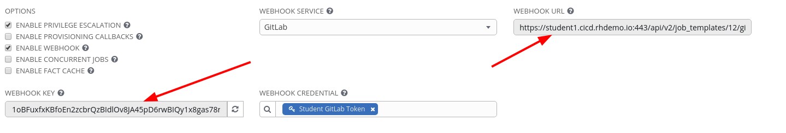

We need to copy these and add them to GitLab

# Step 2: Enable Webhook to our GitLab Project

Navigate in GitLab to our Project and select on the left hand verticle Settings and then Webhooks

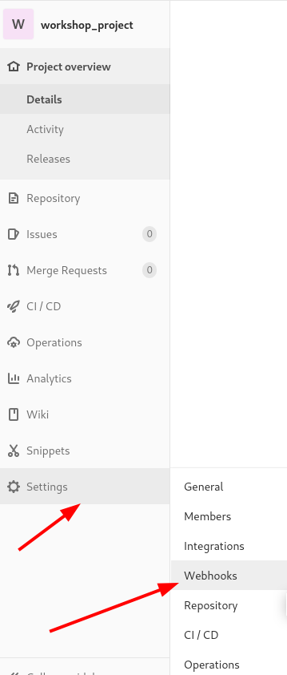

Copy the URL from tower to **URL** and the WEBHOOK KEY to **Secret Token**
Set the trigger to be on **Merge request events** 

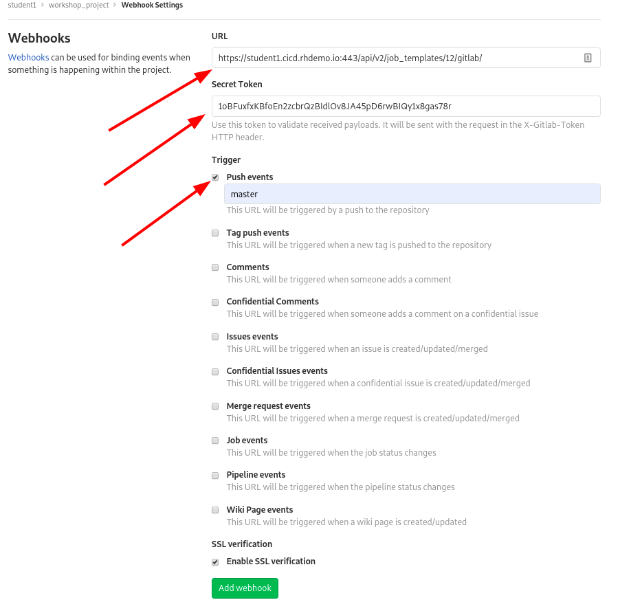

Select Add webhook 


# Step 3: Create Git Branches

In GitLab create the branches for qa and prod. On our project in GitLab go to the Project overview

Click on the + to the right of the workshop_project

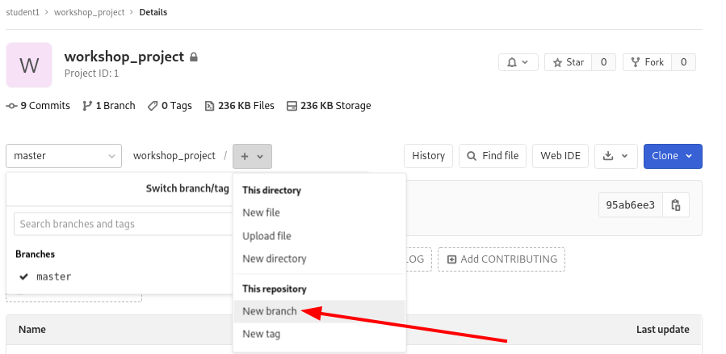

Create both qa and prod

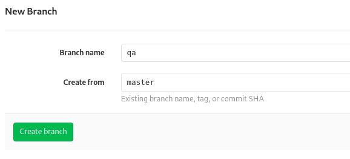

# Step 4: Make a change to the master git repo

In Visual Studio Code, lets change the apache_test_message for all 3 environmnets ( dev,qa and prod )

Navigate to inventory and group_vars and ensure you have a dev, qa and prod file if not create them and add in the following

**dev**

apache_test_message: Hello World Welcome to the DEV Group

**qa**

apache_test_message: Hello World Welcome to the QA Group

**prod**

apache_test_message: Hello World Welcome to the PROD Group

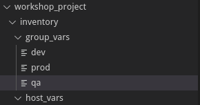

# Step 5: Git commit and push to GitLab

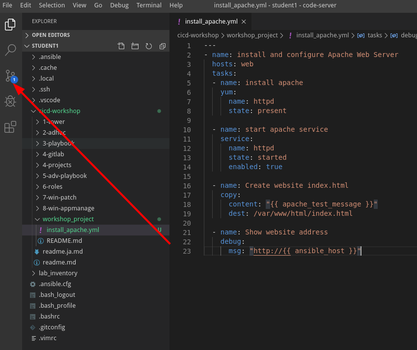


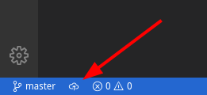

# Step 6: Perform a git Merge

In GitLab go to your project and select Merge Requests

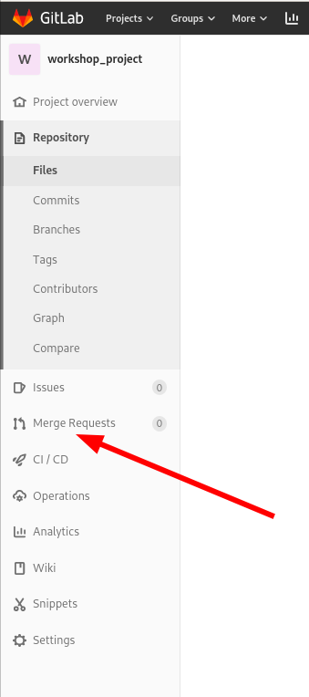

Select New merge request


Ensure the source branch is set to master and the target branch is set to qa

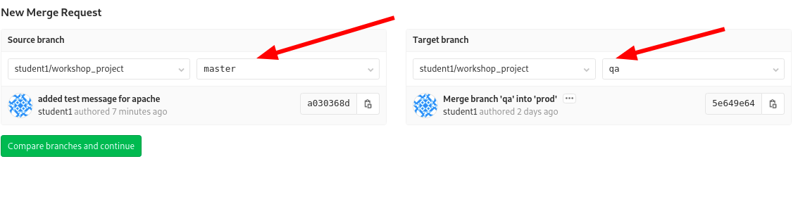

Click on Compare branches and continue


You will see the Title has the git commit message from the source, There is no requirement to fill this form out any further for our needs today but in a real world you would want to complete this for an audit trail.

Click on submit merge request.


We will see in Tower jobs the job automatically run

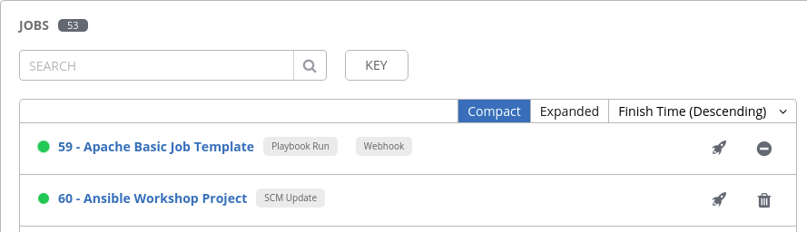

Once it completes you will also see in the GitLab Merge request the pipeline results came back

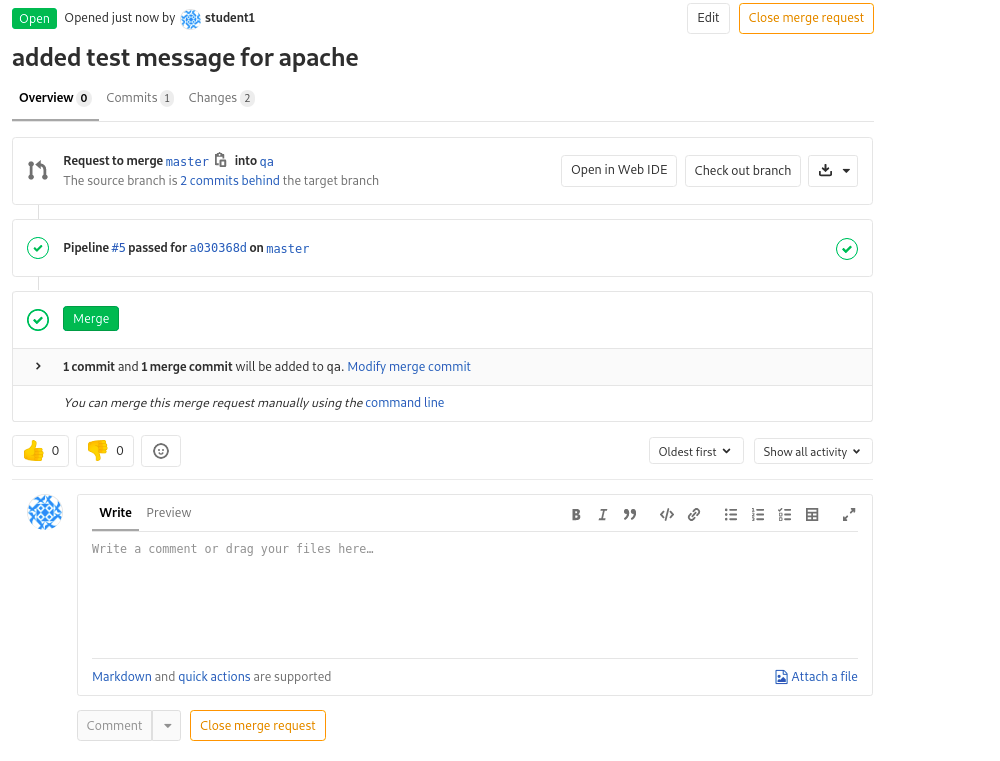

** This is great but it ran against my dev environment I want it to run against qa.

Now that the initial test run completed we can see in the job output the extra vars that came from GitLab

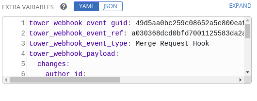


If we click on Expand we can see everthing that came with the GitLab Payload

this has the source branch and the qa branch, so we can use this variable in our playbook hosts

There are 2 references for both each child object is referenced by a '.'

we will use the following

**tower_webhook_payload.object_attributes.target_branch**

We can simply edit our playbook hosts section to reference this like so.

```yaml
---
- name: install and configure Apache Web Server
  hosts: "{{ tower_webhook_payload.object_attributes.target_branch | default ('dev') }}"
  tasks:
```

Note that we have put in a default value, if we want to run this but dont have a merge request associated with it then it will default to **dev**

Now if we recommit this and then do another merge request we will see it target our qa hosts.

