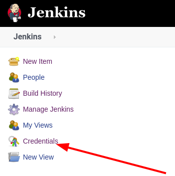
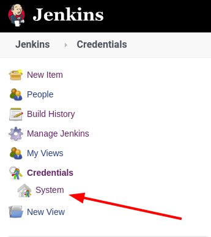
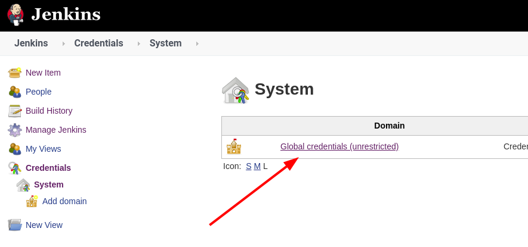
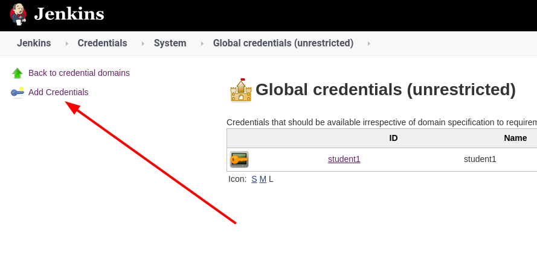
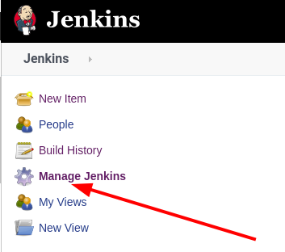
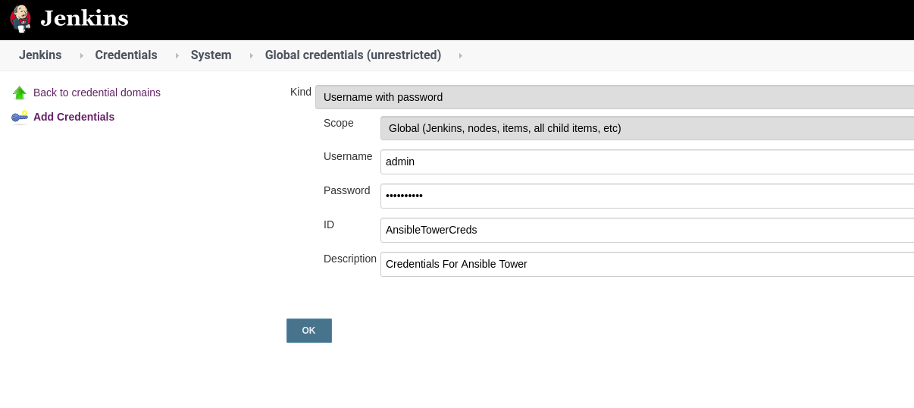

Setting up the Jenkins Tower Plugin
=========================
The Install of Jenkins took care of the plugins and we already installed the Tower plugin as part of that.

For reference, Ansible can install plugins as part of the jenkins_plugin module information on the module can be found here.

https://docs.ansible.com/ansible/latest/modules/jenkins_plugin_module.html

a task would look like this.

```
- name: Ensure latest ansible-tower plugin is installed
  jenkins_plugin:
    name: ansible-tower
    state: latest
```

Step 1:
-------

To Create our credential for Tower click on Credentials



Then System



Then Global Credentials



and now Add Credentials




On the Main Jenkins Dashboard click on Manage Jenkins



Step 2:
-------

Fill Out the Credential with the following

| Key          | Value           
|--------------|-----------------------|------------------------------------|
| Kind         | Student Account       |                                    |
| Scope        | Default               |                                    |
| Username     | Machine               |                                    |
| Password     | *****                 | Replace with your student password |
| ID           | AnsibleTowerCred      |                                    |
| Description  | Credential for Tower  |                                    |


Click the  icon and add new credential

Step 3:
