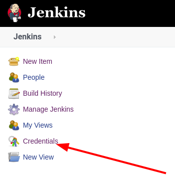
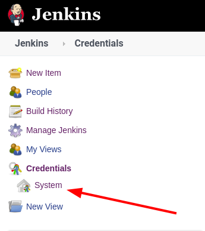
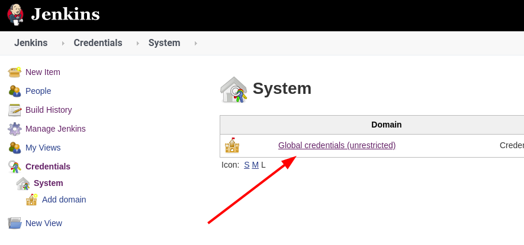
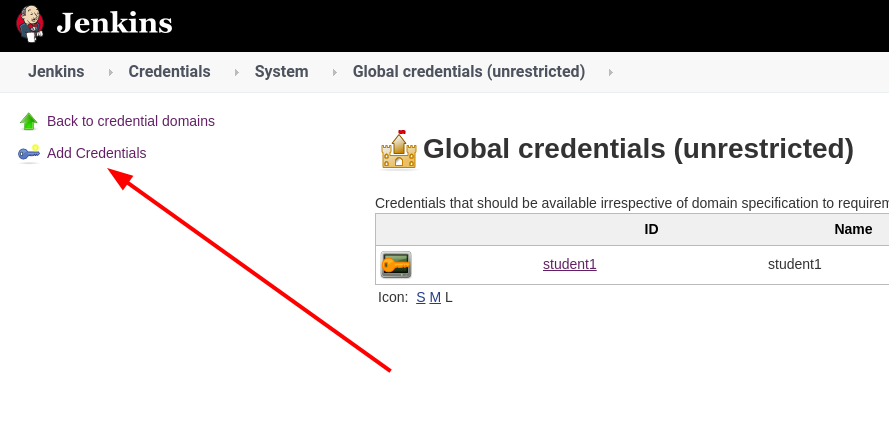
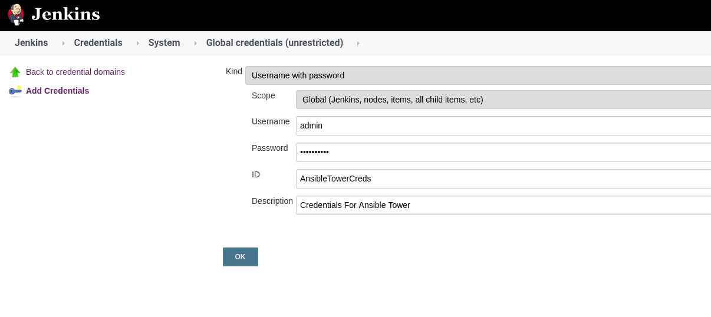

Setting up the Jenkins Tower Plugin
=========================
The Install of Jenkins took care of the plugins and we already installed the Tower plugin as part of that.

For reference, Ansible can install plugins as part of the jenkins_plugin module information on the module can be found here.

https://docs.ansible.com/ansible/latest/modules/jenkins_plugin_module.html

a task would look like this.

```
- name: Ensure latest ansible-tower plugin is installed
  jenkins_plugin:
    name: ansible-tower
    state: latest
```

Step 1:
-------

To Create our credential for Tower click on Credentials



Then System



Then Global Credentials



and now Add Credentials




On the Main Jenkins Dashboard click on Manage Jenkins


Step 2:
-------

Fill Out the Credential with the following

| Key          | Value           |                                     
|--------------|------------------------|
| Kind         | Username with password |
| Scope        | Global                 |
| Username         | Admin
| Password         | `your tower password`
| ID         | AnsibleTowerCred
| Description         | Credential for Tower


Click the  icon and add new credential

Step 3:
-------

Complete the form using the following entries:

| Key          | Value           
|--------------|-----------------|------------------------------------------|
| Name         | Student Account |                                          |
| Organization | Default         |                                          |
| Type         | Machine         |                                          |
| Username     | student#        | **Replace # with your student number**   |
| Password     | *****           | Replace with your student password       |


Step 4:
-------

Select SAVE   

Create an SCM Credential
========================

Our first credential was to access our Windows machines. We need another
to access our source code repository. Repeat the process as above, but
with the following details:

| Key          | Value                            |                                            |
|--------------|----------------------------------|--------------------------------------------|
| Name         | Git Credential                   |                                            |
| Description  | SCM credential for playbook sync |                                            |
| Organization | Default                          |                                            |
| Type         | Source Control                   |                                            |
| Username     | student#                         | Replace # with your student number         |
| Password     | *******                          | Replace ******* with your student password |

Select SAVE   


Creating a Project
==================

A Project is a logical collection of Ansible playbooks, represented in
Tower. You can manage playbooks and playbook directories by either
placing them manually under the Project Base Path on your Tower server,
or by placing your playbooks into a source code management (SCM) system
supported by Tower, including Git, Subversion, and Mercurial.

Step 1:
-------
A **Project** is a logical collection of Ansible playbooks, represented in Tower. 

You can manage playbooks and playbook directories by either placing them manually on your Tower server, or by placing your playbooks into a source code management (SCM) system supported by Tower, including Git, Subversion, Mercurial, and Red Hat Insights.

In this environment, playbooks are stored in a git repository available on the workshop GitLab instance. Before a **Project** can be created in Ansible Tower, the git URL for the repository is needed. In order to obtain the URL to your project, login to the GitLab instance, select your workshop project and copy the `https` url presented after clicking the "Clone" button.


The repo url will be used in **Step 3**

Step 2:
-------

Click **Projects** on the left hand panel.


Click the  icon and add new project

Step 3:
-------

Complete the form using the following entries (**using your student
number in SCM URL**)

| Key            | Value                                                                   |                                                   |
|----------------|-------------------------------------------------------------------------|---------------------------------------------------|
| Name           | Ansible Workshop Project                                                |                                                   |
| Description    | Workshop playbooks                                                      |                                                   |
| Organization   | Default                                                                 |                                                   |
| SCM Type       | Git                                                                     |                                                   |
| SCM URL        | https://gitlab.**WORKSHOP**.rhdemo.io/**student#**/workshop_project.git | URL obtained from Step 1                          |
| SCM BRANCH     |                                                                         | Intentionally blank                               |
| SCM CREDENTIAL | Git Credential                                                          |                                                   |


SCM UPDATE OPTIONS

- [ ] Clean
- [ ] Delete on Update
- [x] Update Revision on Launch


Step 4:
-------

Select SAVE 

Step 5:
-------

Scroll down and validate that project has been successfully synchronized
against the source control repo upon saving. You should see a green icon
next to the project name in the list view at the bottom of the page.


Inventories
===========

An inventory is a collection of hosts against which jobs may be
launched. Inventories are divided into groups and these groups contain
the actual hosts. Inventories may be sourced manually, by entering host
names into Tower, or from one of Ansible Tower’s supported cloud
providers.

A static Inventory has already been created for you today. We will now
take a look at this inventory to show case the various features.

Step 1:
-------

Click **Inventories** from the left hand panel. You will see the
preconfigured Inventory listed. Click the Inventories' name **Workshop 
Inventory** or the Edit button. 

Step 2:
-------

You will now be viewing the Inventory. From here you can add Hosts,
Groups, or even add Variables specific to this Inventory.


We will be viewing the hosts, so click the **HOSTS** button.

Step 3:
-------

In the Hosts view, we can see every host associated with this
inventory. You will also see which groups a host is associated with.
Hosts can be associated with multiple groups. These groups can later
then be used to narrow down to the exact hosts we will later run our
playbooks on.


Step 4:
-------

If you click the **GROUPS** button and then select the **web** group, you can inspect variables set at the group level that will apply to all hosts in that group.


Today, we have already defined a handful of variables to tell Ansible how to connect to hosts in this group. You do not have to define these variables as
a Group variable here, they could also be Host variables or reside
directly in your Template or Playbook. However, because these variables will be the same for **ALL** web hosts in our environment, we defined them for the entire web group.

If you click the **HOSTS** button, you can view the hosts belonging to the windows group. If you click the link for the host on this page, you can view the host specific variables that have been defined.


**`ansible_host`**

This is the IP address of this particular server

These variables are very host specific thus have been defined at the host level instead of at the group level.